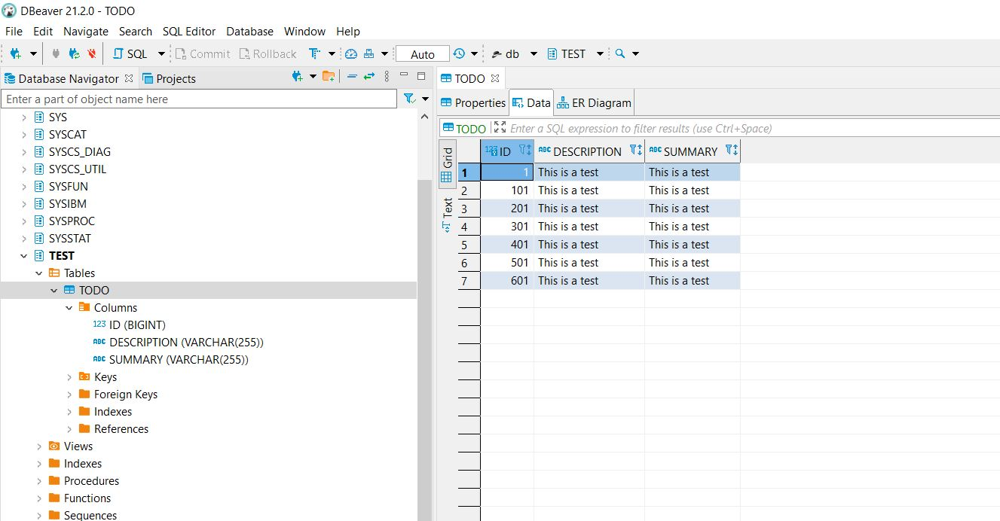

# DAT250: Software Technology Experiment Assignment 2

## Experiment 1: Application using JPA

### Todo example

- Forked repo from [here](https://github.com/timKraeuter/dat250-jpa-example)
- Problems with versions:
  - [EL Severe]: metadata: 2021-09-05 17:02:48.906--ServerSession(553871028)--The no.hvl.dat250.jpa.basicexample.Todo class was compiled with an unsupported JDK. Report this error to the EclipseLink open 
source project.
  - Installed Java SE11 and set environment variable JAVA_HOME to version 11. This fixed the problem. Did not do any further research
- Inspected embedded database using DBeaver 21.2.0
- Added lombok to dependencies in pom.xml and installed lombok extension in vs code
- Removed setters and getters from Todo class.
- Confirmed that code is still working

### Family example
- Followed tutorial
- Tests failed on assertion of correct number of People in Family
- Inspected database and could not find the expected join table between People and Family since the mappedby property is set in Family.
- Moved @OneToMany annotation from field (as in tutorial) to the get method. Deleted the database and ran the tests again. All tests passed.

## Experiment 2: Banking/Credit Card example JPA
- created project using maven template in vscode. In the last example I had some problems with paths and folder structure that seems to be important in java/maven. Have not investigated this further.
- Created classes according to class diagram.
- Implemented example object world in junit test. Verified results by inspecting database using Dbeaver.
- Tested objectlink between person/address by asserting that the person in address was the same as retrieved from Person table.

## Problems and things to remember:
- I should use the maven and java tool in VS code to make sure the project is properly organized
- Make sure that the source/target properties in pom.xml and JAVA_HOME variable are set to the correct Java version
- Consider using [development container](https://github.com/microsoft/vscode-remote-try-java) for next assignment
